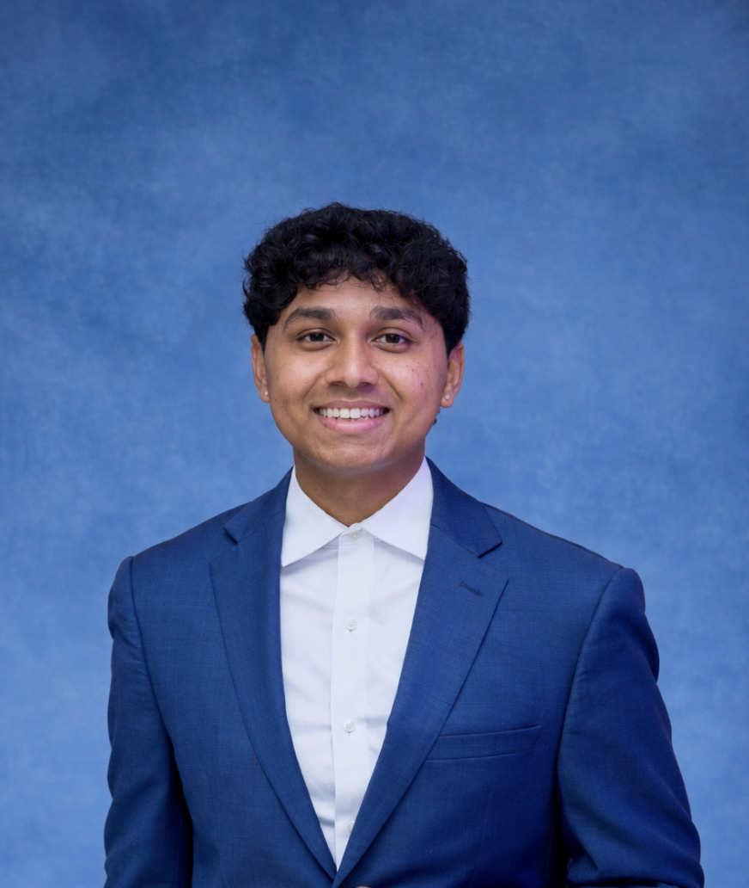

# Hi, I'm Ishaan Samantray

### Where wet lab meets code.

  
  
  
  

 

## ⚡ Highlights

- 🔬 **Research @ NIH National Eye Institute** — imaging + AI for retinal disease
- 🤖 **Built Kairos** — a multi-agent AI command center that triages anonymous tips by phone & SMS in ~8 seconds
- 🌍 **Founder & former President, Kids For Code** — taught 10,000+ students across 37 states & 11 countries, 100+ instructors, 100,000+ YouTube views

---

Biomedical Engineering + Computer Science at **Cornell University**. I work where wet-lab research meets software, from medical-imaging AI at the NIH to building agentic AI systems that ship. I like fixing the layer everyone else builds on, and turning research problems into things that actually run.

🌐 More at **[ishaansamantray.com](https://ishaansamantray.com)**

---

## 🚀 Selected Work

- **[Kairos](https://threat-vector.vercel.app)** &nbsp;`AI`&nbsp;&nbsp;A multi-agent command center that takes anonymous school-safety tips by phone and SMS and triages each one in about 8 seconds. *Built at the YC Call My Agent Hackathon.* &nbsp;([code](https://github.com/devteamaegis/threat-vector) · [demo](https://www.youtube.com/watch?v=6oZcUjKFwf4))
- **[Ara Co-Pilot](https://github.com/devteamaegis/ara-copilot)** &nbsp;`macOS`&nbsp;&nbsp;An AI assistant that transcribes your calls locally with Whisper and surfaces answers from your calendar, email, and notes. *Built at the Ara.so × DayDreamers Hackathon.*
- **AguaClara Website** &nbsp;`Web`&nbsp;&nbsp;Cornell webmaster for AguaClara, rebuilding the team's website. I care a lot about clean, fast, well-designed web.

---

## 🛠 Stack

**`Languages`**
 

**`Frameworks`**
 

**`AI`**
 

**`Infra & Tools`**
 

---

